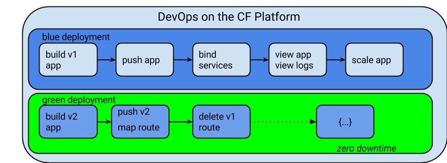
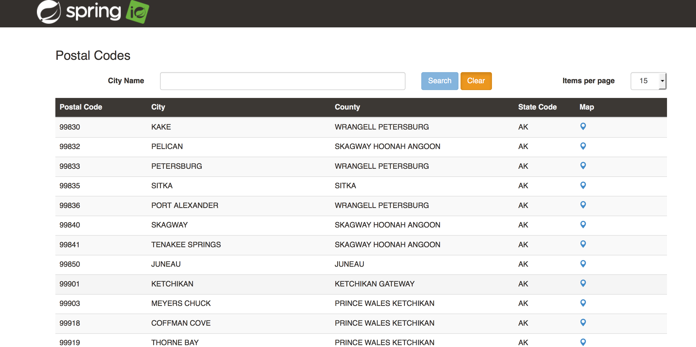
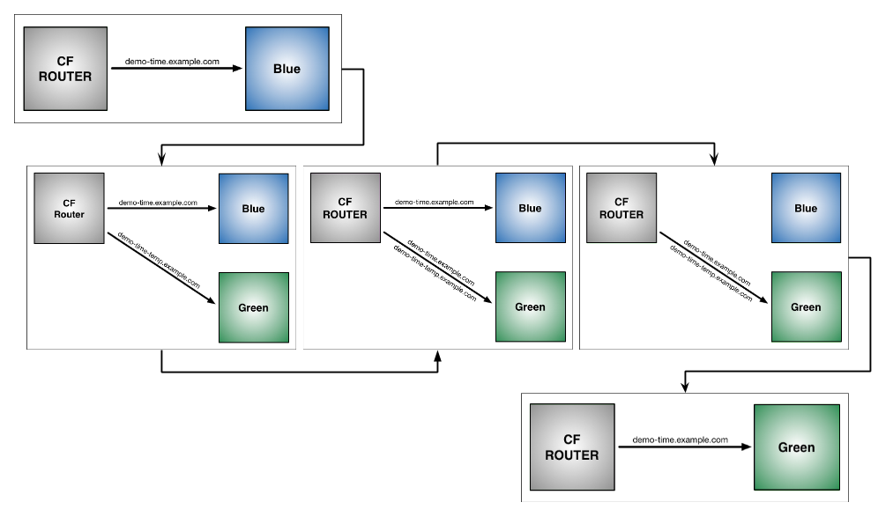

= Dev Ops on Cloud Foundry Platform

== Goals

To deploy and configure a microservice and UI, leverage the platform for monitoring & management of the microservice, and do a blue green deployment with zero downtime.

== Prerequisites 

. Java SDK 1.6+
. Git link:https://mac.github.com/[github.com]
. Go link:https://golang.org/doc/install[Go Programming Language Install]
. MySQL Workbench link:http://www.mysql.com/products/workbench/[MySQL Workbench] or other MySQL tool
. Cloud Foundry CLI link:https://github.com/cloudfoundry/cli/releases[`CF CLI Releases`]
. Curl link:http://curl.haxx.se/[curl]
. Pivotal Web Services Account. Create a free trial account here link:http://run.pivotal.io/[`Pivotal Web Services`]
. Familiarity with Spring link:http://www.spring.io[Spring IO]

== Pre-work

. Fork and Clone link:https://github.com/Pivotal-Field-Engineering/pcf-workspace-devops/[`PCF Workspace for DevOps`]  
. Review the link:https://github.com/Pivotal-Field-Engineering/pcf-workspace-devops/tree/master[Overview] of the `cities` application.  

== Steps
In this workshop we are going to follow these steps to deploy apps on Cloud foundry and manage the lifecycle of the application. 

[NOTE]
The instructions in this document are for Mac/Linux based CLI/Shell. If you are using Windows, you can use link:http://docs.cloudfoundry.org/devguide/installcf/install-go-cli.html#windows[Windows CLI] 
or a Virtual Box / Vagrant with a link:./vagrant.adoc[Linux VM].

=== Building apps
To build the app go to the workspace folder

[source,bash]
----
cd pcf-workspace-devops/cities
./gradlew clean
./gradlew build
----

== PART 1: Build, Push, Bind, Monitor and Scale an App. 

=== Pushing the cities-service app using CLI

Use `cf help` and/or `cf <command> --help` for details on each of the commands below.

. Review the docs: http://docs.pivotal.io/pivotalcf/devguide/deploy-apps/deploy-app.html
. Login to the PCF Env. Edit and Source the `env` file `cities` folder
+
[source,bash]
----
 export CF_SYSTEM_DOMAIN=
 export CF_APPS_DOMAIN=
 export CF_USER=
 export CF_ORG=
 export CF_SPACE=
----
CF_SYSTEM_DOMAIN will look similar to run.pivotal.io +
CF_APPS_DOMAIN will look similar to cfapps.io +
CF_USER is the user account to sign into Pivotal Cloud Foundry, which is usually your email address. +
CF_ORG is the name of the Organization within Pivotal Cloud Foundry where you want to deploy your applications. +
CF_SPACE is the name of the Space within the above Organization where you want your application deployed. +

+
[source,bash]
----
$ source ./env
$ cf login -a https://api.$CF_SYSTEM_DOMAIN -u $CF_USER -o $CF_ORG -s $CF_SPACE 
----
[NOTE]
add `--skip-ssl-validation` if you are pointing to CF installation which is using self signed certificates. 

+
. Verify you are logged in with your own userid (*not admin*) and targeted to your PCF instance:
+
[source,bash]
----
$ cf target
----

. Push the cities-service:
Before pushing the app, check if the route exists and we can reach it. 

+
[source,bash]
----
$ cd cities-service
$ cf check-route <first-initial><last-initial>-cities-service cfapps.io
$ cf push <first-initial><last-initial>-cities-service -i 1 -m 512M -p build/libs/cities-service-0.0.1-SNAPSHOT.jar
----
+
* Be sure to name your application '<first-initial><last-initial>-cities-service'

. Verify you can access your application via a curl request or from a Web Browser:
+
[source,bash]
----
$ curl -i http://<first-initial><last-initial>-cities-service.cfapps.io
----

The output from this command should look similar to the following:
[source,bash]
----
HTTP/1.1 200 OK
Content-Type: application/hal+json
Date: Mon, 18 May 2015 21:05:28 GMT
Server: Apache-Coyote/1.1
X-Application-Context: rj-cities-service:cloud:0
X-Cf-Requestid: 229f02ff-4e0e-46d9-7536-36ef7f50e7a3
Content-Length: 147
Connection: keep-alive

{
  "_links" : {
    "cities" : {
      "href" : "http://rj-cities-service.cfapps.io/cities{?page,size,sort}",
      "templated" : true
    }
  }
----

=== Enabling Spring Cloud & Profiles

. Review link:http://docs.pivotal.io/pivotalcf/buildpacks/java/spring-service-bindings.html[Configuring Service Connections in Spring]

. Notice the Spring Cloud and MySQL dependencies to our Gradle build file (build.gradle)
+
[source,groovy]
----
dependencies {
    // ....
    compile("org.springframework.cloud:spring-cloud-spring-service-connector:1.0.0.RELEASE")
    compile("org.springframework.cloud:spring-cloud-cloudfoundry-connector:1.0.0.RELEASE")
    runtime("mysql:mysql-connector-java:5.1.25")
}
----
+
. Copy the Spring Cloud Config file +org.example.cities.config.CloudDataSourceConfig+. 
+
[source,bash]
----
$ cp templates/CloudDataSourceConfig.java src/main/java/org/example/cities/config/
$ ./gradlew clean
$ ./gradlew build
----
+
. Review the Spring Cloud Config files (CloudDataSourceConfig.java and application.properties). 
.. The `@Profile` annotation will cause this class (which becomes Spring configuration when annotated as `@Configuration`) to be added to the configuration set because of the `SPRING_PROFILES_ACTIVE` environment variable (more on this later). You can still run the application locally (with the default profile) using the embedded database.
.. With this code, Spring Cloud will detect a bound service that is compatible with +DataSource+, read the credentials, and then create a +DataSource+ as appropriate (it will throw an exception otherwise).
+
[source,java]
----
package org.example.cities.config;

import javax.sql.DataSource;

import org.springframework.cloud.config.java.AbstractCloudConfig;
import org.springframework.context.annotation.Bean;
import org.springframework.context.annotation.Configuration;
import org.springframework.context.annotation.Profile;

@Profile("cloud")
@Configuration
public class CloudDataSourceConfig extends AbstractCloudConfig {
    @Bean
    public DataSource dataSource() {
        return connectionFactory().dataSource();
    }
}
----
+
.. The properties file at `src/main/resources/application.properties` will cause Hibernate to create the database schema and import data at startup. This is done automatically for embedded databases, not for custom ++DataSource++s. Other Hibernate native properties can be set in a similar fashion:
+
[source,java]
----
spring.jpa.hibernate.ddl-auto=create
----
+
. Now do a cf push. Notice that the push will fail. In the next step you can learn why.  
+
[source,bash]
----
$ cf push <first-initial><last-initial>-cities-service -i 1 -m 512M -p build/libs/cities-service-0.0.1-SNAPSHOT.jar
----
+
. Check the logs to learn more about why the application is not starting
+
[source,bash]
----
$ cf logs <first-initial><last-initial>-cities-service --recent 
----
+

=== Manually Creating a Database Service

Looks like we need a service.  Let's create one.

. Review the docs on Services:
+
* link:http://docs.pivotal.io/pivotalcf/devguide/services/adding-a-service.html[Adding a Service]
* link:http://docs.pivotal.io/pivotalcf/devguide/services/managing-services.html[Managing Services]
+

. Create a mysql service instance, name it as `<YOUR INITIALS>-cities-db`
You can create the service from the `cli` or launch the App Manager http://console.run.pivotal.io and login. 
Navigate to the marketplace and see the available services. Here you will create the service using the CLI.
+
[source,bash]
----
$ cf marketplace // check if cleardb mysql service is available 
$ cf create-service cleardb spark <first-initial><last-initial>-cities-db
----
+

. Launch the DB console via the `Manage` link in the App Manager.  Note the database is empty.

=== Manually Binding the Service Instance 

. Review the docs on link:http://docs.pivotal.io/pivotalcf/devguide/services/bind-service.html[Binding a Service Instance]

. Bind the mysql instance `<YOUR INITIALS>-cities-db` to your app cities-service
You can bind from the App Manager or from the `cli`
+
[source,bash]
----
$ cf bind-service <first-initial><last-initial>-cities-service <first-initial><last-initial>-cities-db
----
+

. Restage your cities-service application to inject the new database.

+
[source,bash]
----
$ cf restage <first-initial><last-initial>-cities-service
----

Notice that the application is now running. 

. Check the Env variables to see if the service is bound. 
You can do it from App Manager or from the `cli`
+
[source,bash]
----
$ cf env <first-initial><last-initial>-cities-service
----
+
. Check the MySQL database to see that it now contains data using MySQL Workbench or a similar tool.

=== Binding Services via the Manifest

Next, let's push the cities-service app with a manifest to help automate deployment.

. Review the documentation: http://docs.pivotal.io/pivotalcf/devguide/deploy-apps/manifest.html
. Copy the application manifest  `manifest.yml` from your `cities-service/templates` directory to `cities-service`.  
+
[source,bash]
----
$ cp templates/manifest.yml .
----
+
. Set the name of the app, the amount of memory, the number of instances, and the path to the .jar file.
*Be sure to name your application '<first-initial><last-initial>-cities-service' and use this as the host value.*
. Add the services binding `<YOUR INITIALS>-cities-db` to your deployment manifest for cities-service .
. Set the `SPRING_PROFILES_ACTIVE` environment variable to `cloud` in your deployment manifest.
. Now, manually unbind the service and re-push your app using the manifest. 
+
[source,bash]
----
$ cf unbind-service <first-initial><last-initial>-cities-service <first-initial><last-initial>-cities-db
----
+
. Test your manifest by re-pushing your app with no parameters:
+
[source,bash]
----
$ cf push
----
Notice that using a manifest, you have moved the command line parameters (number of instances, memory, etc) into the manifest.
. Verify you can access your application via a curl request:
[source,bash]
----
$ curl -i http://<first-initial><last-initial>-cities-service.cfapps.io
----
We must be able to access your application at https://<first-initial><last-initial>-cities-service.cfapps.io for the next steps to work properly.

[QUESTION]
How would you set the `SPRING_PROFILES_ACTIVE` variable from the CLI?

=== Health, logging & events via the CLI

Learning about how your application is performing is critical to help you diagnose and troubleshoot potential issues. Cloud Foundry gives you options for viewing the logs.

To tail the logs of your application perform this command:
[source,bash]
----
$ cf logs <first-initial><last-initial>-cities-service
----

Notice that nothing is showing because there isn't any activity. Use the following curl commmand to see the application working:
[source,bash]
----
$ curl -i http://<first-initial><last-initial>-cities-service.cfapps.io/cities/
----

For other ways of viewing logs check out the documentation here: http://docs.pivotal.io/pivotalcf/devguide/deploy-apps/streaming-logs.html#view

To view recent events, including application crashes, and error codes, you can see them from the App Manager or from the cli. 
[source,bash]
----
$ cf events <first-initial><last-initial>-cities-service
----

To view the health of the application you can see from the App Manager or from the cli:
[source,bash]
----
$ cf app <first-initial><last-initial>-cities-service
----
You will get detailed output of the health
[source,bash]
----
Showing health and status for app cities-service in org  / space development as...
OK

requested state: started
instances: 1/1
usage: 512M x 1 instances
urls: cities-service.cfapps.io
last uploaded: Wed May 27 15:53:32 UTC 2015
stack: cflinuxfs2

     state     since                    cpu    memory           disk           details   
#0   running   2015-05-27 12:17:55 PM   0.1%   434.5M of 512M   145.4M of 1G      
----

=== Environment variables

View the environment variable and explanation of link:http://docs.cloudfoundry.org/devguide/deploy-apps/environment-variable.html#view-env [VCAP Env]

[source,bash]
----
$ cf env <first-initial><last-initial>-cities-service
----

You will get the output similar to this on your terminal
[source,bash]
----
Getting env variables for app rj-cities-service in org Central / space development as rajesh.jain@pivotal.io...
OK

System-Provided:
{
 "VCAP_SERVICES": {
  "cleardb": [
   {
    "credentials": {
     "hostname": "xxxx",
     "jdbcUrl": "xxxx",
     "name": "xxxx",
     "password": "xxxx",
     "port": "3306",
     "uri": "mysql://xxxx?reconnect=true",
     "username": "xxxx"
    },
    "label": "cleardb",
    "name": "rj-cities-db",
    "plan": "spark",
    "tags": [
     "Data Stores",
     "Cloud Databases",
     "Developer Tools",
     "Data Store",
     "mysql",
     "relational"
    ]
   }
  ]
 }
}

{
 "VCAP_APPLICATION": {
  "application_name": "rj-cities-service",
  "application_uris": [
   "rj-cities-service.cfapps.io"
  ],
  "application_version": "c3c35527-424f-4dbc-a4ea-115e1250cc5d",
  "limits": {
   "disk": 1024,
   "fds": 16384,
   "mem": 512
  },
  "name": "rj-cities-service",
  "space_id": "56e1d8ef-e87f-4b1c-930b-e7f46c00e483",
  "space_name": "development",
  "uris": [
   "rj-cities-service.cfapps.io"
  ],
  "users": null,
  "version": "c3c35527-424f-4dbc-a4ea-115e1250cc5d"
 }
}

User-Provided:
SPRING_PROFILES_ACTIVE: cloud

No running env variables have been set

No staging env variables have been set
----

=== Scaling apps

Applications can be scaled via the command line or the console. When we talk about scale, there are two different types of scale: Vertical and Horizontal. Read link:http://docs.cloudfoundry.org/devguide/deploy-apps/cf-scale.html[this] doc on more details on scaling applications. 

When you vertically scale your application, you are increasing the amount of memory made available to your application. Scaling your application horizontally means that you are adding application instances.

Let's vertically scale the application to 1 GB of RAM. 
[source,bash]
----
$ cf scale <first-initial><last-initial>-cities-service -m 1G
----

Now scale your application down to 512 MB.

Next, let's scale up your application to 2 instances
[source,bash]
----
$ cf scale <first-initial><last-initial>-cities-service -i 2
----

To check the status of your applications you can check from the command line to see how many instances your app is running and their current state
[source,bash]
----
$ cf app <first-initial><last-initial>-cities-service
----

Once the second instance as started, scale the app back down to one instance.

=== Verify the app from the Console

To verify that the application is running, use the following curl commands to retrieve data from the service or use a browser to access the URL:

[source,bash]
----
$ curl -i http://<first-initial><last-initial>-cities-service.cfapps.io/cities
----

[source,bash]
----
$ curl -i http://<first-initial><last-initial>-cities-service.cfapps.io/cities/162
----

[source,bash]
----
$ curl -i http://<first-initial><last-initial>-cities-service.cfapps.io/cities?size=5
----

== PART 2: Deploying Upstream App and Bind to backend services

The `cities` directory also includes a `cities-ui` application which uses the `cities-client` to consume from the `cities-service`.

The `cities-client` demonstrates using the link:http://cloud.spring.io/spring-cloud-connectors[Spring Cloud Connector] project to consume from a microservice.  This is a common pattern for 3rd platform apps.  For more details on building 12 Factor Apps for the 3rd platform (Cloud Foundry) refer to link:http://12factor.net/[this] website. 

The goal of this exercise is to use what you have learned to deploy the `cities-ui` application.

=== Build the Cities UI and Cities Client App

The cities-ui and cities-client can be both built at once by running `./gradlew assemble` in the parent +cities+ directory. Run this commmand now.

=== Create a User Provided Service Instance.
In this section we will create a backend microservice end point for cities-service.

* Review the documentation on link:http://docs.pivotal.io/pivotalcf/devguide/services/user-provided.html[User Provided Service Instances]
* Look for the details by running `cf cups --help`.

* You will need to specify two parameters when you create the service instance: `uri` and `tag` (see: CitiesWebServiceInfoCreator.java in the cities-client project).
** The `uri` should point to your deployed microservice
** The `tag` is a property specified in the CitiesWebServiceInfoCreator.  Tags have a special meaning in CF:
+
_Tags provide a flexible mechanism to expose a classification, attribute, or base technology of a service, enabling equivalent services to be swapped out without changes to dependent logic in applications, buildpacks, or other services. Eg. mysql, relational, redis, key-value, caching, messaging, amqp.  Tags also allow application configurations to be independent of a service instance name._

+ 
* Refer to the CitiesWebServiceInfoCreator class for the necessary tag value.

[source,bash]
----
// Use the interactive prompt to create user defined service
// It will prompt you for the parameters

$ cf create-user-provided-service <first-initial><last-initial>-cities-ws -p "uri,tag"

uri>   http://<first-initial><last-initial>-cities-service.cfapps.io/
tag>   cities

Creating user provided service....
----

=== Deploy cities-ui project 

A `manifest.yml` is included in the cities-ui app.  Edit this manifest with your initials and add the service binding to your cities-service 

[source,bash]
----
---
applications:
- name: <YOUR INITIALS>-cities-ui
  memory: 512M
  instances: 1
  path: build/libs/cities-ui.jar
  services: [ <YOUR INITIALS>-cities-ws ]
  env:
    SPRING_PROFILES_ACTIVE: cloud
----

Push the `cities-ui` without specifying the manifest.yml. It will by default pick the manifest.yml file and deploy the app. 
[source,bash]
----
$ cf push 
----

Note the URL once the application has been successfully pushed.

=== Verify the backend service is bound to cities-ui

[source,bash]
----
$ cf env <first-initial><last-initial>cities-ui

System-Provided:
{
 "VCAP_SERVICES": {
  "user-provided": [
   {
    "credentials": {
     "tag": "cities",
     "uri": "http://rj-cities-service.cfapps.io/"
    },
    "label": "user-provided",
    "name": "cities-ws",
    "syslog_drain_url": "",
    "tags": []
   }
  ]
 }
}

{
 "VCAP_APPLICATION": {
  "application_name": "rj-cities-ui",
  "application_uris": [
   "rj-cities-ui.cfapps.io"
  ],
  "application_version": "dceb111b-3a68-45ad-83fd-3b8b836ebbe7",
  "limits": {
   "disk": 1024,
   "fds": 16384,
   "mem": 512
  },
  "name": "rj-cities-ui",
  "space_id": "56e1d8ef-e87f-4b1c-930b-e7f46c00e483",
  "space_name": "development",
  "uris": [
   "rj-cities-ui.cfapps.io"
  ],
  "users": null,
  "version": "dceb111b-3a68-45ad-83fd-3b8b836ebbe7"
 }
}

User-Provided:
SPRING_PROFILES_ACTIVE: cloud
----

=== Access the cities-ui to verify it is connected to your microservice.
Open the App Manager (Console) and navigate to your apps. You will see the cities-ui app, with a link to launch the cities-ui application. Alternatively you can open up your browser and navigate to the URL listed from a successful cf push command. 

== PART 3: Deploy Version 2 of the App

In this section we are going to do a green-blue deployment using a shell script. The same can be done by executing the commands one at a time. 

=== Delete the unversioned app and the route
[source,bash]
----
cf delete <first-initial><last-initial>-cities-ui
cf delete-route cfapps.io -n <first-initial><last-initial>-cities-ui
----

=== Push Version 2 and Delete the Old Route using the script
We are going to deploy the next version of the `cities-ui` app. The deployment typically is automated using a CD pipeline built with Jenkins or any CD automation tool, but in this workshop we will walk through a simple version number change in the deployment manifest. 

. Edit the `manifest.yml` with the following variables
[source,bash]
---
 VERSION: CITIES_APP_2_0
---

. Edit and source the `env` file from the cities-ui folder with the following variables

[source,bash]
---
 export CF_SYSTEM_DOMAIN=
 export CF_APPS_DOMAIN=
 export CF_USER=
 export CF_ORG=
 export CF_SPACE=
 export CF_APP=<first-initial><last-initial>-cities-ui
 export CF_JAR=build/libs/cities-ui.jar
 export CF_MANIFEST=manifest.yml
 export BUILD_NUMBER=2001
---

Note: Be sure to change the CF_APP name to match your application and add the BUILD_NUMBER to the env file.

. Using the bash script `blue-green.sh` in the cities-ui directory, deploy the green v2 and delete the blue v1 of the app. 

[source,bash]
----
source env
cf login -a https://api.$CF_SYSTEM_DOMAIN -u $CF_USER -o $CF_ORG -s $CF_SPACE --skip-ssl-validation

DEPLOYED_VERSION_CMD=$(CF_COLOR=false cf apps | grep $CF_APP- | cut -d" " -f1)
DEPLOYED_VERSION="$DEPLOYED_VERSION_CMD"
ROUTE_VERSION=$(echo "${BUILD_NUMBER}" | cut -d"." -f1-3 | tr '.' '-')
echo "Deployed Version: $DEPLOYED_VERSION"
echo "Route Version: $ROUTE_VERSION"

# push a new version and map the route
cf push "$CF_APP-$BUILD_NUMBER" -n "$CF_APP-$ROUTE_VERSION" -d $CF_APPS_DOMAIN -p $CF_JAR -f $CF_MANIFEST
cf map-route "$CF_APP-${BUILD_NUMBER}" $CF_APPS_DOMAIN -n $CF_APP

if [ ! -z "$DEPLOYED_VERSION" -a "$DEPLOYED_VERSION" != " " -a "$DEPLOYED_VERSION" != "$CF_APP-${BUILD_NUMBER}" ]; then
  echo "Performing zero-downtime cutover to $BUILD_NUMBER"
  echo "$DEPLOYED_VERSION" | while read line
  do
    if [ ! -z "$line" -a "$line" != " " -a "$line" != "$CF_APP-${BUILD_NUMBER}" ]; then
      echo "Scaling down, unmapping and removing $line"
      # Unmap the route and delete
      cf unmap-route "$line" $CF_APPS_DOMAIN -n $CF_APP
      cf delete "$line" -f
      cf delete-route $CF_APPS_DOMAIN -n "$line" -f
    else
      echo "Skipping $line"
    fi
  done
fi
----

=== Verify the app, zero downtime
[source,bash]
----
$cf apps | grep -i cities-ui
rj-cities-ui-2001                       started           1/1         512M     1G     rj-cities-ui.cfapps.io, rj-cities-ui-5001.cfapps.io   

----

[source,bash]
----
$cf routes | grep -i cities-ui

development   rj-cities-ui                                           cfapps.io   rj-cities-ui-2001   
development   rj-cities-ui-2001                                      cfapps.io   rj-cities-ui-2001   

----

[source,bash]
----

$ curl -i http://<first-initial><last-initial>-cities-ui.cfapps.io/cities/version

HTTP/1.1 200 OK
Content-Type: text/plain;charset=ISO-8859-1
Date: Thu, 21 May 2015 02:22:29 GMT
Server: Apache-Coyote/1.1
X-Application-Context: rj-cities-ui-5001:cloud:0
X-Cf-Requestid: d9fa0481-5cb4-47cd-6335-35adf575a0b6
Content-Length: 4
Connection: keep-alive

2001

----
=== Repeat the Process
Change the version and build numbers and run the script to do blue-green deployment. Check the output using curl.

=== Process of Blue Green Deployment

Review the CF Document for blue green deployment link:http://docs.cloudfoundry.org/devguide/deploy-apps/blue-green.html[Using Blue-Green Deployment to Reduce Downtime and Risk]

In summary Blue-green deployment is a release technique that reduces downtime and risk by running two identical production environments called Blue and Green.

=== Newsworthy: Automated Blue Green with cf plugin
Cloud Foundry plugin link:https://github.com/concourse/autopilot[Autopilot] does blue green deployment, albeit it takes a different approach to other zero-downtime plugins. It doesn't perform any complex route re-mappings instead it leans on the manifest feature of the Cloud Foundry CLI. The method also has the advantage of treating a manifest as the source of truth and will converge the state of the system towards that. This makes the plugin ideal for continuous delivery environments.

[source,bash]
----
$ go get github.com/concourse/autopilot
$ cf install-plugin $GOPATH/bin/autopilot

$ cf zero-downtime-push application-to-replace \
    -f path/to/new_manifest.yml \
    -p path/to/new/path
    
----

== Recap

In this workshop we saw how to build, deploy, bind, scale, monitor apps on Cloud foundry and manage the lifecycle of the application

== Q/A
